<p align="center">
  
</p>

<h1 align="center">Oikos</h1>

<p align="center">
  <strong>The self-hosted family planner that respects your privacy.</strong><br>
  Tasks, calendars, shopping, meals, budget, notes, contacts — <br>
  all in one place, on your own server.
</p>

<p align="center">
  <a href="https://github.com/ulsklyc/oikos/releases"></a>
  <a href="https://github.com/ulsklyc/oikos/blob/main/LICENSE"></a>
  <a href="https://nodejs.org"></a>
  <a href="https://www.docker.com"></a>
  <a href="https://www.zetetic.net/sqlcipher/"></a>
  <a href="https://web.dev/progressive-web-apps/"></a>
  
</p>

<p align="center">
  <a href="#-screenshots">Screenshots</a>&ensp;·&ensp;
  <a href="#-features">Features</a>&ensp;·&ensp;
  <a href="#-quick-start">Quick Start</a>&ensp;·&ensp;
  <a href="#-security">Security</a>&ensp;·&ensp;
  <a href="#-contributing">Contributing</a>
</p>

<br>

<p align="center">
  
</p>

---

## Why Oikos?

Most family organizers are cloud apps with monthly subscriptions, data mining, and vendor lock-in. Oikos takes a different approach:

- **Your server, your data** — runs in a single Docker container on your own hardware. Nothing leaves your network.
- **No subscriptions** — free and open source, forever. MIT licensed.
- **No tracking** — zero telemetry, zero analytics, zero third-party scripts.
- **Offline-first** — works as a PWA on phones and tablets, even without connectivity.
- **Encrypted at rest** — optional AES-256 database encryption via SQLCipher.
- **Lightweight** — vanilla JavaScript frontend with no framework and no build step. Express + SQLite backend. Minimal resource footprint.

Oikos is designed for **one family on one server** — not a SaaS product, not a team tool, not multi-tenant. It's a private, self-contained household organizer for 2–6 people.

---

## 📸 Screenshots

<table>
  <tr>
    <td align="center" width="33%">
      <picture>
        <source media="(prefers-color-scheme: dark)" srcset="docs/screenshots/mobile-dark/mobile-dark-dashboard.png">
        <source media="(prefers-color-scheme: light)" srcset="docs/screenshots/mobile-light/mobile-light-dashboard.png">
        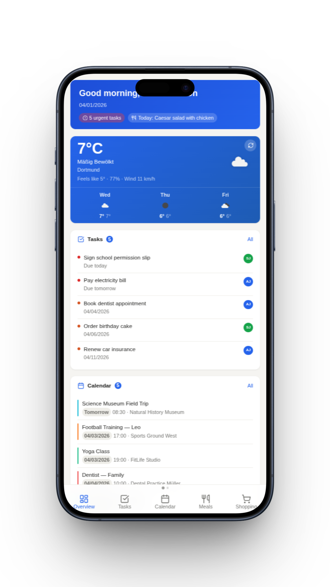
      </picture>
      <br><strong>Dashboard</strong>
    </td>
    <td align="center" width="33%">
      <picture>
        <source media="(prefers-color-scheme: dark)" srcset="docs/screenshots/mobile-dark/mobile-dark-tasks.png">
        <source media="(prefers-color-scheme: light)" srcset="docs/screenshots/mobile-light/mobile-light-tasks.png">
        
      </picture>
      <br><strong>Tasks</strong>
    </td>
    <td align="center" width="33%">
      <picture>
        <source media="(prefers-color-scheme: dark)" srcset="docs/screenshots/mobile-dark/mobile-dark-calendar.png">
        <source media="(prefers-color-scheme: light)" srcset="docs/screenshots/mobile-light/mobile-light-calendar.png">
        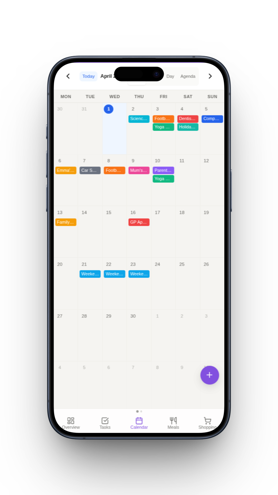
      </picture>
      <br><strong>Calendar</strong>
    </td>
  </tr>
  <tr>
    <td align="center" width="33%">
      <picture>
        <source media="(prefers-color-scheme: dark)" srcset="docs/screenshots/mobile-dark/mobile-dark-shopping.png">
        <source media="(prefers-color-scheme: light)" srcset="docs/screenshots/mobile-light/mobile-light-shopping.png">
        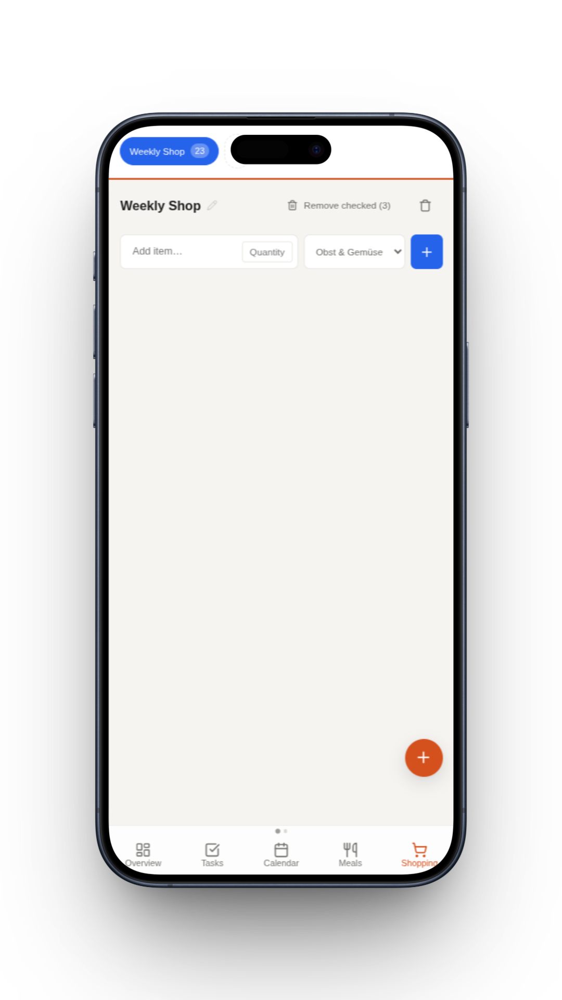
      </picture>
      <br><strong>Shopping</strong>
    </td>
    <td align="center" width="33%">
      <picture>
        <source media="(prefers-color-scheme: dark)" srcset="docs/screenshots/mobile-dark/mobile-dark-meal.png">
        <source media="(prefers-color-scheme: light)" srcset="docs/screenshots/mobile-light/mobile-light-meal.png">
        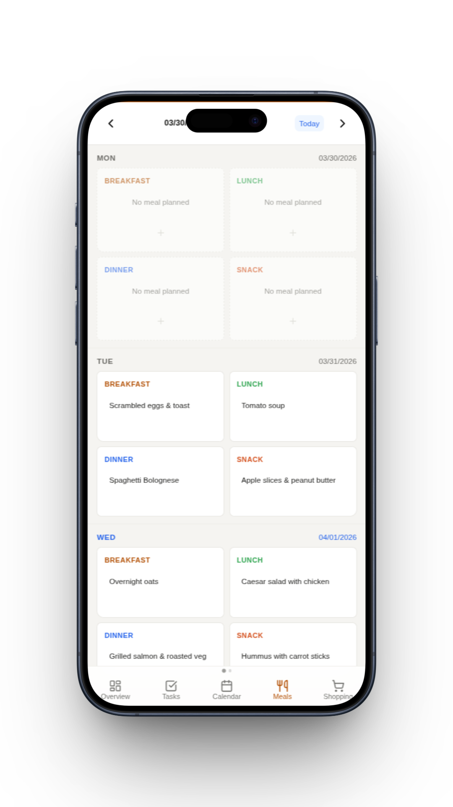
      </picture>
      <br><strong>Meals</strong>
    </td>
    <td align="center" width="33%">
      <picture>
        <source media="(prefers-color-scheme: dark)" srcset="docs/screenshots/mobile-dark/mobile-dark-budget.png">
        <source media="(prefers-color-scheme: light)" srcset="docs/screenshots/mobile-light/mobile-light-budget.png">
        
      </picture>
      <br><strong>Budget</strong>
    </td>
  </tr>
  <tr>
    <td align="center" width="33%">
      <picture>
        <source media="(prefers-color-scheme: dark)" srcset="docs/screenshots/mobile-dark/mobile-dark-notes.png">
        <source media="(prefers-color-scheme: light)" srcset="docs/screenshots/mobile-light/mobile-light-notes.png">
        
      </picture>
      <br><strong>Notes</strong>
    </td>
    <td align="center" width="33%">
      <picture>
        <source media="(prefers-color-scheme: dark)" srcset="docs/screenshots/mobile-dark/mobile-dark-contacts.png">
        <source media="(prefers-color-scheme: light)" srcset="docs/screenshots/mobile-light/mobile-light-contacts.png">
        
      </picture>
      <br><strong>Contacts</strong>
    </td>
    <td align="center" width="33%">
      <picture>
        <source media="(prefers-color-scheme: dark)" srcset="docs/screenshots/mobile-dark/mobile-dark-settings.png">
        <source media="(prefers-color-scheme: light)" srcset="docs/screenshots/mobile-light/mobile-light-settings.png">
        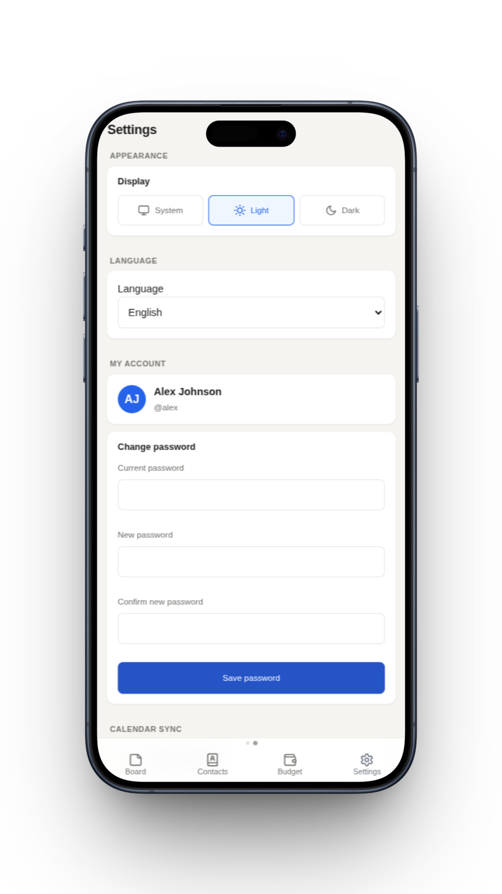
      </picture>
      <br><strong>Settings</strong>
    </td>
  </tr>
</table>

<details>
<summary>Tablet views</summary>
<br>
<table>
  <tr>
    <td align="center" width="50%">
      <picture>
        <source media="(prefers-color-scheme: dark)" srcset="docs/screenshots/tablet-dark/tablet-dark-dashboard.png">
        <source media="(prefers-color-scheme: light)" srcset="docs/screenshots/tablet-light/tablet-light-dashboard.png">
        
      </picture>
      <br><strong>Dashboard</strong>
    </td>
    <td align="center" width="50%">
      <picture>
        <source media="(prefers-color-scheme: dark)" srcset="docs/screenshots/tablet-dark/tablet-dark-tasks.png">
        <source media="(prefers-color-scheme: light)" srcset="docs/screenshots/tablet-light/tablet-light-tasks.png">
        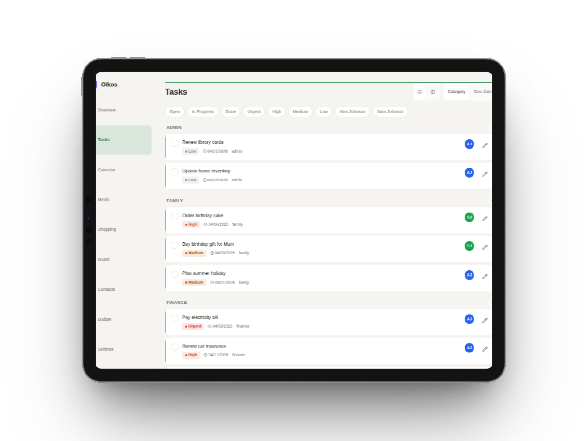
      </picture>
      <br><strong>Tasks</strong>
    </td>
  </tr>
  <tr>
    <td align="center" width="50%">
      <picture>
        <source media="(prefers-color-scheme: dark)" srcset="docs/screenshots/tablet-dark/tablet-dark-calendar.png">
        <source media="(prefers-color-scheme: light)" srcset="docs/screenshots/tablet-light/tablet-light-calendar.png">
        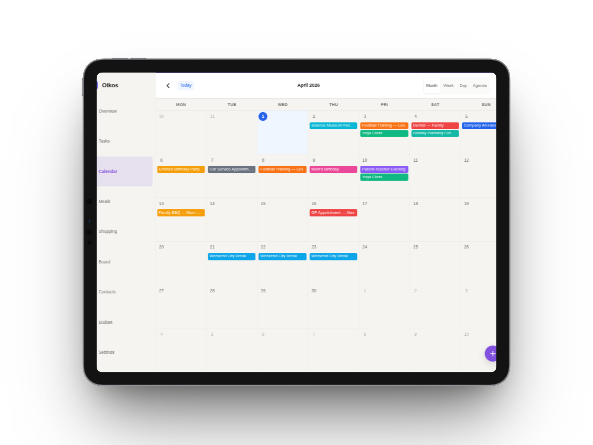
      </picture>
      <br><strong>Calendar</strong>
    </td>
    <td align="center" width="50%">
      <picture>
        <source media="(prefers-color-scheme: dark)" srcset="docs/screenshots/tablet-dark/tablet-dark-shopping.png">
        <source media="(prefers-color-scheme: light)" srcset="docs/screenshots/tablet-light/tablet-light-shopping.png">
        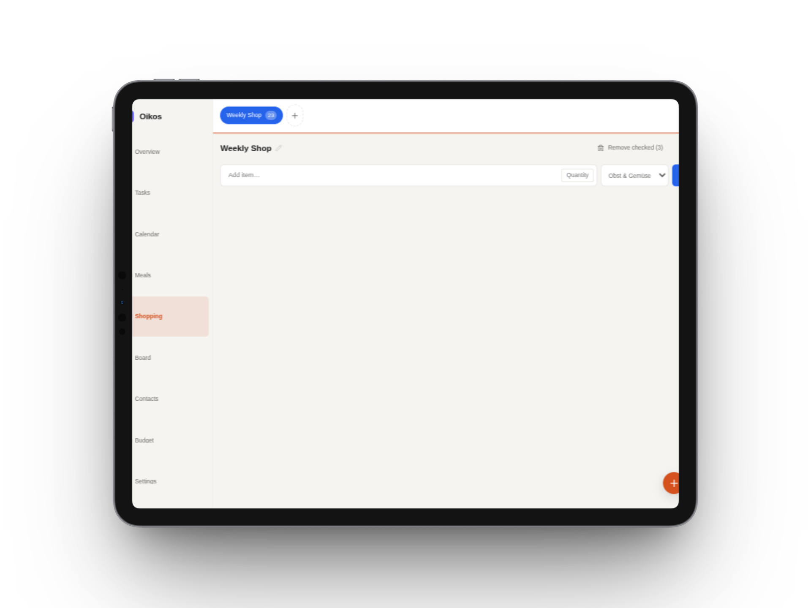
      </picture>
      <br><strong>Shopping</strong>
    </td>
  </tr>
  <tr>
    <td align="center" width="50%">
      <picture>
        <source media="(prefers-color-scheme: dark)" srcset="docs/screenshots/tablet-dark/tablet-dark-meal.png">
        <source media="(prefers-color-scheme: light)" srcset="docs/screenshots/tablet-light/tablet-light-meal.png">
        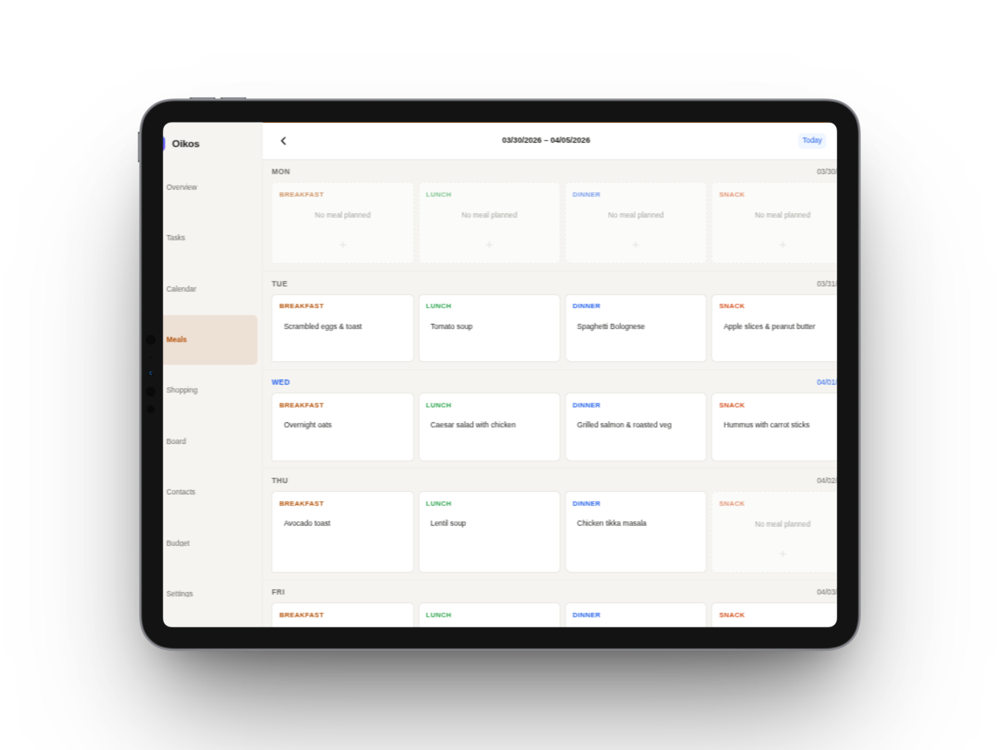
      </picture>
      <br><strong>Meals</strong>
    </td>
    <td align="center" width="50%">
      <picture>
        <source media="(prefers-color-scheme: dark)" srcset="docs/screenshots/tablet-dark/tablet-dark-budget.png">
        <source media="(prefers-color-scheme: light)" srcset="docs/screenshots/tablet-light/tablet-light-budget.png">
        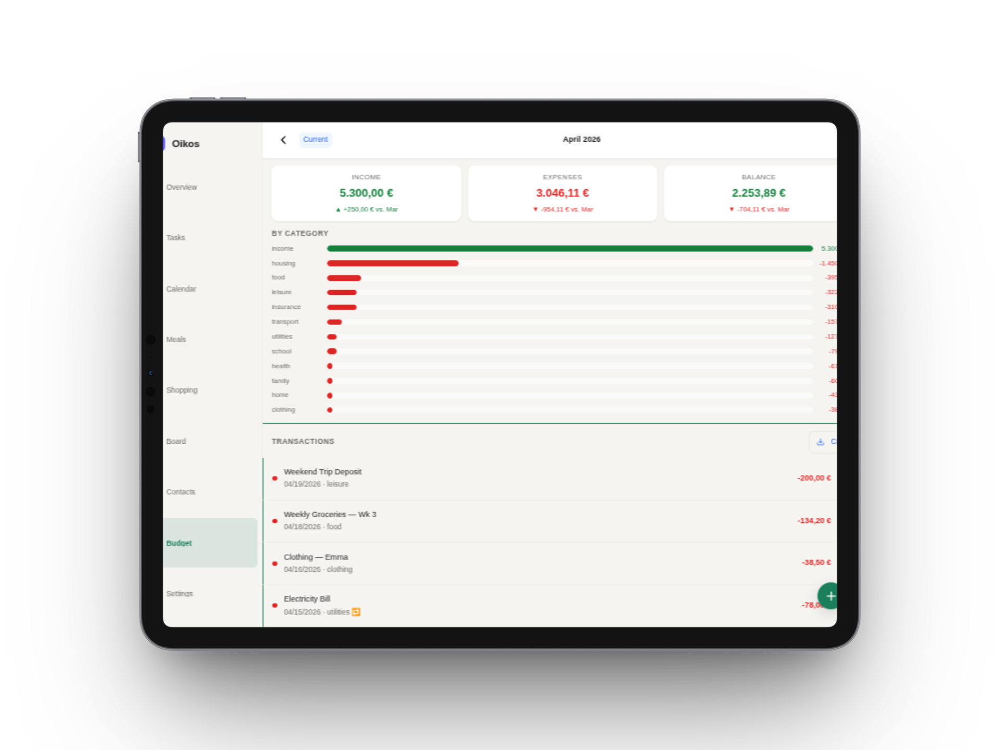
      </picture>
      <br><strong>Budget</strong>
    </td>
  </tr>
  <tr>
    <td align="center" width="50%">
      <picture>
        <source media="(prefers-color-scheme: dark)" srcset="docs/screenshots/tablet-dark/tablet-dark-notes.png">
        <source media="(prefers-color-scheme: light)" srcset="docs/screenshots/tablet-light/tablet-light-notes.png">
        
      </picture>
      <br><strong>Notes</strong>
    </td>
    <td align="center" width="50%">
      <picture>
        <source media="(prefers-color-scheme: dark)" srcset="docs/screenshots/tablet-dark/tablet-dark-contacts.png">
        <source media="(prefers-color-scheme: light)" srcset="docs/screenshots/tablet-light/tablet-light-contacts.png">
        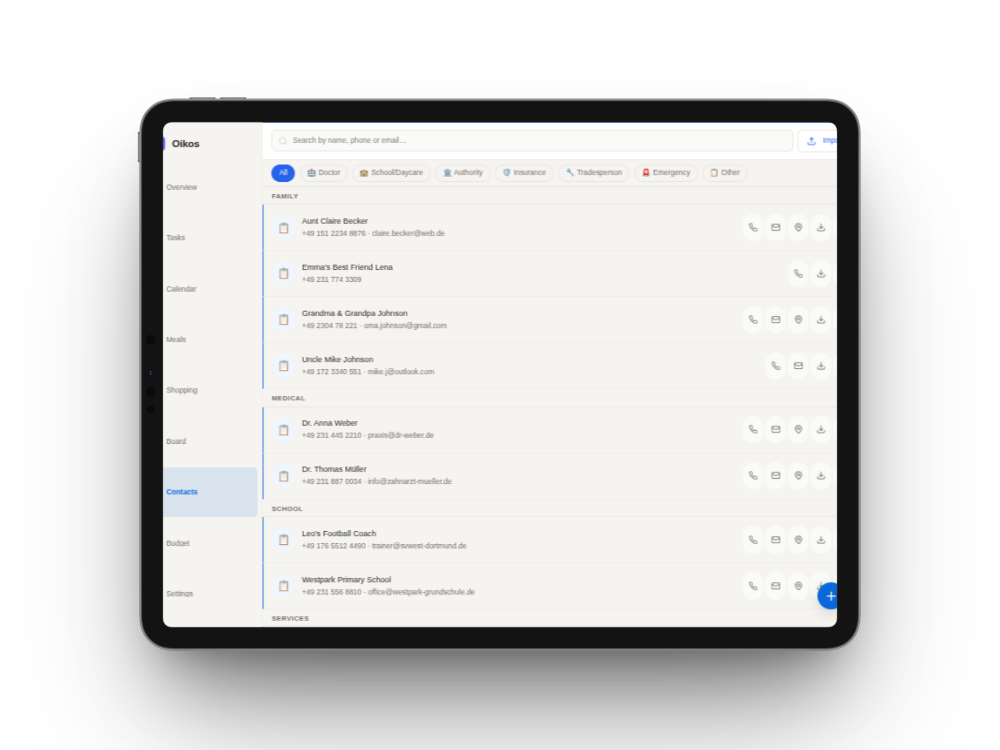
      </picture>
      <br><strong>Contacts</strong>
    </td>
  </tr>
</table>
</details>

<p align="center">
  <sub>Screenshots adapt to your GitHub theme — toggle light/dark mode to see both variants.</sub>
</p>

---

## ✨ Features

<table>
  <tr>
    <td width="50%">

**📋 Dashboard**
At-a-glance family overview — weather, upcoming events, urgent tasks, today's meals, pinned notes.

**✅ Tasks**
List + Kanban views, subtasks, recurring tasks (RRULE), swipe gestures, priority levels.

**🛒 Shopping**
Multiple lists, aisle-grouped categories, auto-import from meal plan, swipe to check off.

**🍽️ Meals**
Weekly planner (Mon–Sun), drag & drop between slots, ingredients, one-click shopping list export.

</td>
<td width="50%">

**📅 Calendar**
Month / week / day / agenda views. Two-way sync with Google Calendar and Apple iCloud.

**📌 Notes**
Colored sticky notes, pinning, full-text search, Markdown formatting toolbar.

**👥 Contacts**
Category filters, tap-to-call/email, map links, vCard import & export.

**💰 Budget**
Income & expense tracking, recurring entries, month-over-month trends, CSV export.

</td>
  </tr>
</table>

**And also:** dark mode with system detection · responsive design (mobile / tablet / desktop) · offline PWA with install prompt · per-module accent colors · multilingual UI (de / en, auto-detected, switchable in Settings) · accessibility (skip links, ARIA, reduced motion) · staggered animations · bottom sheet modals on mobile.

---

## 🛠 Tech Stack

<p>
  
  
  
  
  
</p>

| Layer | Technology |
|:---|:---|
| **Server** | Node.js ≥ 22 · Express · better-sqlite3 · bcrypt · Helmet |
| **Database** | SQLite with optional [SQLCipher](https://www.zetetic.net/sqlcipher/) encryption (AES-256) |
| **Frontend** | Vanilla JavaScript ES modules — no framework, no build step. [Web Components](https://developer.mozilla.org/en-US/docs/Web/API/Web_components) (`oikos-*`). [Lucide Icons](https://lucide.dev) (self-hosted) |
| **Auth** | Session-based · httpOnly cookies · CSRF double-submit · [express-session](https://github.com/expressjs/session) |
| **Deployment** | Docker + Docker Compose · Nginx reverse proxy · Let's Encrypt SSL |
| **Integrations** | [Google Calendar API v3](https://developers.google.com/calendar) (OAuth 2.0) · [Apple iCloud CalDAV](https://developer.apple.com/library/archive/documentation/DataManagement/Conceptual/CloudKitWebServicesReference/) (tsdav) · [OpenWeatherMap](https://openweathermap.org/api) |

---

## 🚀 Quick Start

> **Prerequisites:** Docker and Docker Compose installed on a Linux server.

```bash
# 1. Clone the repository
git clone https://github.com/ulsklyc/oikos.git && cd oikos

# 2. Configure environment
cp .env.example .env
# Edit .env — set SESSION_SECRET (≥32 chars) and optionally DB_ENCRYPTION_KEY

# 3. Start the container
docker compose up -d
# First build takes 2–3 minutes (compiles SQLCipher)

# 4. Create your admin account
docker compose exec oikos node setup.js

# 5. Open http://localhost:3000
```

The admin can create additional family members from **Settings → Family Members**.

> **Production:** See [`nginx.conf.example`](nginx.conf.example) for a reverse proxy config with SSL. If you use [Nginx Proxy Manager](https://nginxproxymanager.com), paste the contents into the Advanced tab. Ensure `X-Forwarded-Proto` is set for session cookies to work correctly.

---

## 🔒 Security

Oikos is designed to run on a private server behind SSL. No public endpoints exist except the login page.

| Layer | Implementation |
|:---|:---|
| **Sessions** | `httpOnly`, `SameSite=Strict`, `Secure` in production, 7-day TTL |
| **CSRF** | Double-submit cookie pattern on all state-changing requests |
| **Passwords** | bcrypt with cost factor 12 |
| **Rate limiting** | 5 login attempts/min, 300 API requests/min per IP |
| **Headers** | Strict Content Security Policy via Helmet (`self`-only) |
| **Encryption** | Optional SQLCipher AES-256 database encryption at rest |
| **Access control** | No API endpoint accessible without session auth (except login) |
| **Registration** | Disabled — only admins can create user accounts |

---

<details>
<summary><strong>Configuration</strong></summary>

### Required

| Variable | Description |
|:---|:---|
| `SESSION_SECRET` | Random string ≥ 32 characters for session signing |
| `DB_ENCRYPTION_KEY` | SQLCipher AES-256 key — leave empty to disable encryption |

### Optional

| Variable | Default | Description |
|:---|:---|:---|
| `PORT` | `3000` | Server port |
| `NODE_ENV` | `development` | Set to `production` for deployment |
| `DB_PATH` | `./oikos.db` | Path to SQLite database file |
| `SYNC_INTERVAL_MINUTES` | `15` | Automatic calendar sync interval |
| `RATE_LIMIT_MAX_ATTEMPTS` | `5` | Max login attempts per minute per IP |

### Weather Widget

Register a free API key at [openweathermap.org](https://openweathermap.org/api):

| Variable | Default | Description |
|:---|:---|:---|
| `OPENWEATHER_API_KEY` | — | Your API key |
| `OPENWEATHER_CITY` | `Berlin` | City name |
| `OPENWEATHER_UNITS` | `metric` | `metric` (°C) or `imperial` (°F) |
| `OPENWEATHER_LANG` | `de` | Language code |

### Integrations

| Variable | Description |
|:---|:---|
| `GOOGLE_CLIENT_ID` | Google OAuth 2.0 Client ID |
| `GOOGLE_CLIENT_SECRET` | Google OAuth 2.0 Client Secret |
| `GOOGLE_REDIRECT_URI` | `https://your-domain/api/v1/calendar/google/callback` |
| `APPLE_CALDAV_URL` | `https://caldav.icloud.com` |
| `APPLE_USERNAME` | Your Apple ID email |
| `APPLE_APP_SPECIFIC_PASSWORD` | App-specific password from Apple ID settings |

Full template: [`.env.example`](.env.example)

</details>

<details>
<summary><strong>Calendar Sync</strong></summary>

Oikos syncs bidirectionally with Google Calendar and Apple iCloud. External events are visually distinguished in the UI. On conflict, the external source wins.

### Google Calendar

1. Create a project at [console.cloud.google.com](https://console.cloud.google.com)
2. Enable the **Google Calendar API**
3. Create an **OAuth 2.0 Client ID** (type: Web application)
4. Add your redirect URI:
   ```
   https://your-domain.com/api/v1/calendar/google/callback
   ```
5. Add credentials to `.env`:
   ```env
   GOOGLE_CLIENT_ID=...
   GOOGLE_CLIENT_SECRET=...
   GOOGLE_REDIRECT_URI=https://your-domain.com/api/v1/calendar/google/callback
   ```
6. Restart: `docker compose up -d`
7. In Oikos: **Settings → Calendar Sync → Connect Google**

**Sync behavior:** Initial sync pulls events from 3 months ago to 12 months ahead. Subsequent syncs use Google's `syncToken` for incremental updates. Local events push to Google automatically. Conflicts: Google wins on simultaneous edits.

### Apple Calendar (iCloud CalDAV)

**Option A — via Settings UI** (recommended, no restart required):

1. Go to [appleid.apple.com](https://appleid.apple.com) → Sign-In and Security → App-Specific Passwords
2. Generate a new password for "Oikos"
3. In Oikos: **Settings → Calendar Sync → Apple Calendar** → enter CalDAV URL, Apple ID, and app-specific password → click **Verbinden & testen**

Credentials are stored in the database. No server restart needed.

**Option B — via `.env`:**

```env
APPLE_CALDAV_URL=https://caldav.icloud.com
APPLE_USERNAME=your@apple-id.com
APPLE_APP_SPECIFIC_PASSWORD=xxxx-xxxx-xxxx-xxxx
```

Restart: `docker compose up -d`. The sync button appears automatically in Settings. `.env` credentials are used as fallback when no UI credentials are saved.

</details>

<details>
<summary><strong>Development</strong></summary>

### Local Setup

```bash
npm install
cp .env.example .env
# Set SESSION_SECRET — skip DB_ENCRYPTION_KEY (no SQLCipher needed locally)
npm run dev        # Starts server with --watch (auto-reload)
```

### Tests

```bash
npm test           # 146+ tests across 9 suites
```

Tests use Node.js built-in test runner with `--experimental-sqlite` for in-memory SQLite. No running server required.

### Architecture

```
server/
  index.js             # Express entry, middleware, static serving
  db.js                # SQLite connection, migration runner
  auth.js              # Session auth + user management routes
  middleware/           # CSRF, input validation
  routes/              # One file per module
  services/            # Calendar sync, recurrence engine
public/
  index.html           # SPA shell
  router.js            # History API router (~50 lines)
  api.js               # Fetch wrapper with auth + CSRF
  styles/              # Design tokens, reset, layout, per-module CSS
  components/          # Web Components (oikos-* prefix)
  pages/               # Page modules with render() export
  sw.js                # Service worker (app-shell caching)
```

**Request flow:** Browser → Express static (`public/`) or `/api/v1/*` → session auth middleware → route handler → better-sqlite3 (sync) → JSON response.

**Database migrations** run automatically on startup. Each migration is an idempotent SQL block in `server/db.js`. Append new migrations — never modify existing ones.

</details>

<details>
<summary><strong>Backup & Restore</strong></summary>

### Backup

```bash
docker run --rm \
  -v oikos_oikos_data:/data \
  -v $(pwd):/backup \
  alpine tar czf /backup/oikos-backup-$(date +%Y%m%d).tar.gz /data
```

### Restore

```bash
docker compose down
docker run --rm \
  -v oikos_oikos_data:/data \
  -v $(pwd):/backup \
  alpine tar xzf /backup/oikos-backup-YYYYMMDD.tar.gz -C /
docker compose up -d
```

Migrations run automatically on startup. Data in the `oikos_data` volume is preserved across container rebuilds.

</details>

<details>
<summary><strong>Updates</strong></summary>

```bash
git pull
docker compose up -d --build
```

Migrations run automatically. Your data volume stays intact.

### Adding Family Members

Only admins can create accounts — there is no public registration.

- **In the browser:** Settings → Family Members → Add Member
- **Via CLI:** `docker compose exec oikos node setup.js`

</details>

---

## 🤝 Contributing

Contributions are welcome! If you find a bug or have a feature idea, [open an issue](https://github.com/ulsklyc/oikos/issues). Pull requests are appreciated — please keep the vanilla JS constraint in mind (no frameworks, no build tools).

See [`CONTRIBUTING.md`](CONTRIBUTING.md) for setup instructions, code conventions, commit format, and workflow.

---

## License

[MIT](LICENSE) © 2026 ulsklyc

<p align="center">
  <sub>Made with care for families who value their privacy.</sub>
</p>
