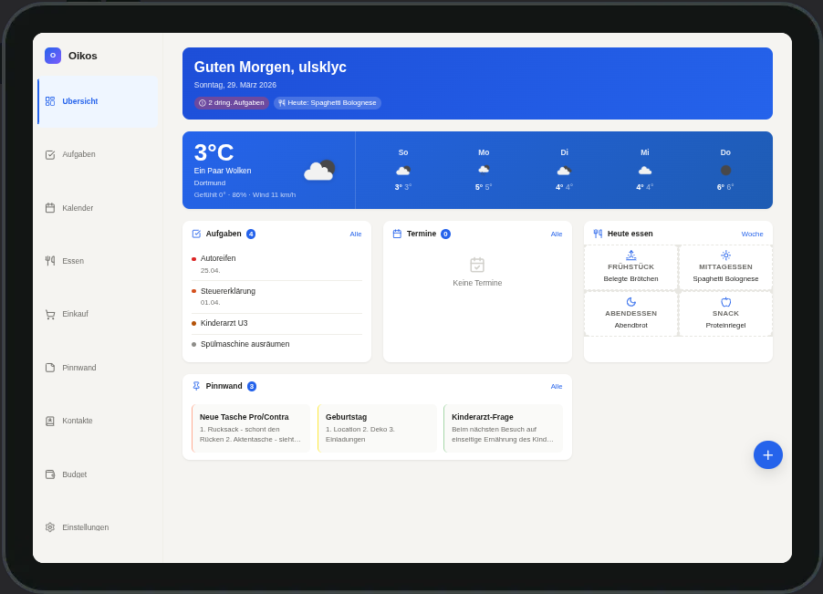
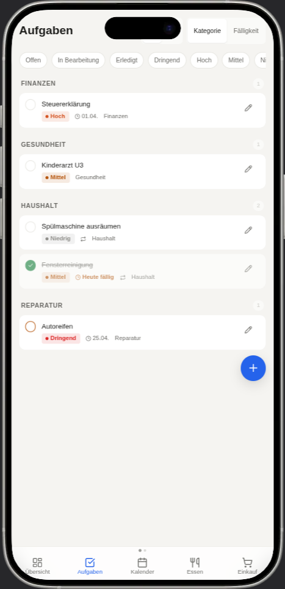
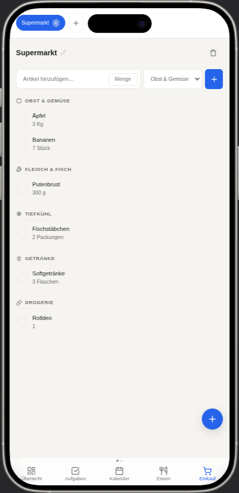
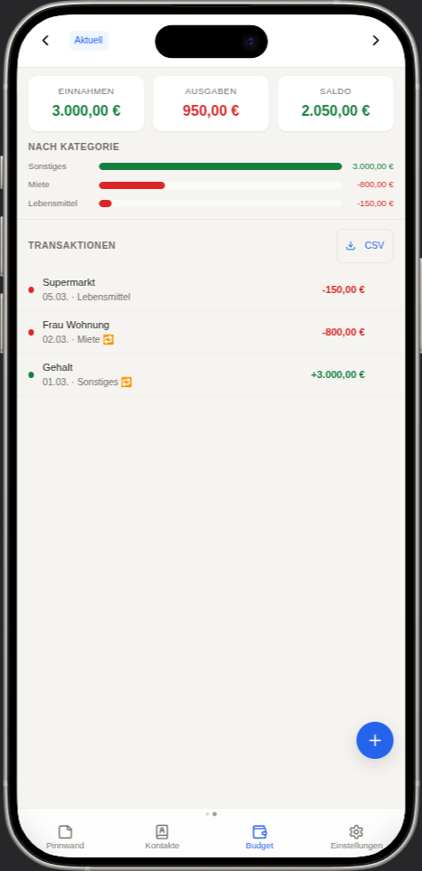
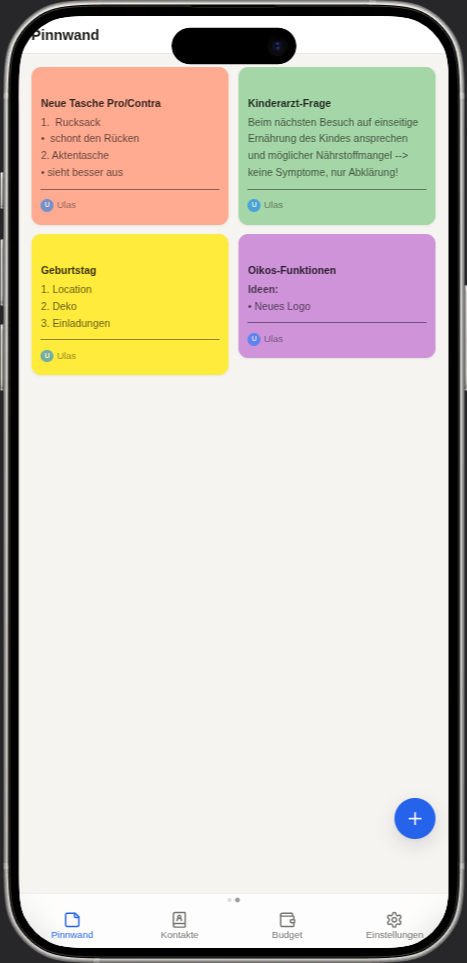
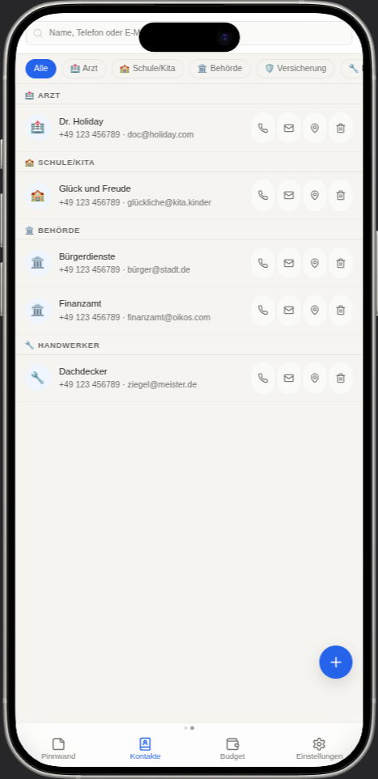
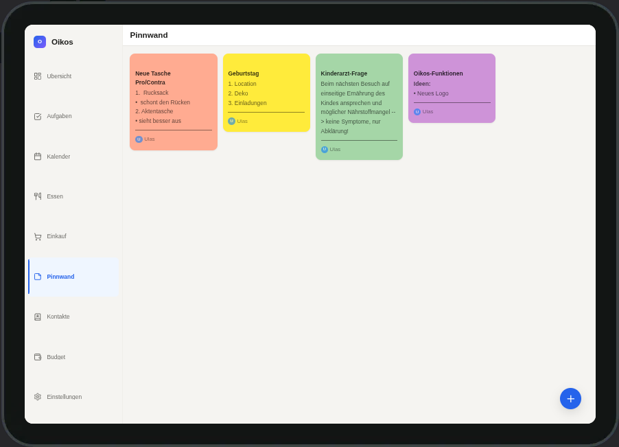

<p align="center">
  <!-- Logo: Replace with your logo once created (recommended: SVG, 128×128 or 256×256) -->
  <!--  -->
  <h1>🏠 Oikos</h1>
  <strong>Self-hosted family planner — private, open, no subscription.</strong>
</p>

<p align="center">
  <a href="https://github.com/ulsklyc/oikos/blob/main/LICENSE"></a>
  =20">
  
  
  
  <a href="https://github.com/ulsklyc/oikos/stargazers"></a>
  <a href="https://github.com/ulsklyc/oikos/commits/main"></a>
</p>

<p align="center">
  Oikos is a self-hosted family organizer for 2–6 people. Tasks, calendars, shopping lists, meal plans, budget tracking, and more — all running on your own server. No cloud dependency. No data leaves your network. No tracking.
</p>

<p align="center">
  <a href="#features">Features</a> · <a href="#quick-start">Quick Start</a> · <a href="#configuration">Configuration</a> · <a href="#calendar-sync">Calendar Sync</a> · <a href="#security">Security</a>
</p>

---

<p align="center">
  <picture>
    <source media="(prefers-color-scheme: dark)" srcset="docs/screenshots/tablet-dark/tablet-dark-dashboard.png">
    <source media="(prefers-color-scheme: light)" srcset="docs/screenshots/tablet-light/tablet-light-dashboard.png">
    
  </picture>
</p>

<table>
  <tr>
    <td align="center" width="33%">
      <picture>
        <source media="(prefers-color-scheme: dark)" srcset="docs/screenshots/mobile-dark/mobile-dark-tasks.png">
        <source media="(prefers-color-scheme: light)" srcset="docs/screenshots/mobile-light/mobile-light-tasks.png">
        
      </picture>
      <br><strong>Tasks</strong>
    </td>
    <td align="center" width="33%">
      <picture>
        <source media="(prefers-color-scheme: dark)" srcset="docs/screenshots/mobile-dark/mobile-dark-household.png">
        <source media="(prefers-color-scheme: light)" srcset="docs/screenshots/mobile-light/mobile-light-household.png">
        
      </picture>
      <br><strong>Shopping</strong>
    </td>
    <td align="center" width="33%">
      <picture>
        <source media="(prefers-color-scheme: dark)" srcset="docs/screenshots/mobile-dark/mobile-dark-budget.png">
        <source media="(prefers-color-scheme: light)" srcset="docs/screenshots/mobile-light/mobile-light-budget.png">
        
      </picture>
      <br><strong>Budget</strong>
    </td>
  </tr>
  <tr>
    <td align="center">
      <picture>
        <source media="(prefers-color-scheme: dark)" srcset="docs/screenshots/mobile-dark/mobile-dark-notes.png">
        <source media="(prefers-color-scheme: light)" srcset="docs/screenshots/mobile-light/mobile-light-notes.png">
        
      </picture>
      <br><strong>Notes</strong>
    </td>
    <td align="center">
      <picture>
        <source media="(prefers-color-scheme: dark)" srcset="docs/screenshots/mobile-dark/mobile-dark-contacts.png">
        <source media="(prefers-color-scheme: light)" srcset="docs/screenshots/mobile-light/mobile-light-contacts.png">
        
      </picture>
      <br><strong>Contacts</strong>
    </td>
    <td align="center">
      <picture>
        <source media="(prefers-color-scheme: dark)" srcset="docs/screenshots/tablet-dark/tablet-dark-notes.png">
        <source media="(prefers-color-scheme: light)" srcset="docs/screenshots/tablet-light/tablet-light-notes.png">
        
      </picture>
      <br><strong>Tablet View</strong>
    </td>
  </tr>
</table>

<p align="center">
  <sub>Screenshots adapt to your GitHub theme — switch between light and dark mode to see both variants.</sub>
</p>

## Features

| | Module | What it does | Highlights |
|---|---|---|---|
| 📋 | **Dashboard** | At-a-glance overview of your family's day | Weather widget, upcoming events, urgent tasks, today's meals, pinned notes |
| ✅ | **Tasks** | Shared to-do lists with accountability | List + Kanban views, subtasks, recurring tasks (RRULE), swipe gestures, priority levels |
| 🛒 | **Shopping** | Collaborative grocery lists | Multiple lists, aisle-grouped categories, auto-import from meal plan |
| 🍽️ | **Meals** | Weekly meal planning | Week view (Mon–Sun), ingredient management, one-click export to shopping list |
| 📅 | **Calendar** | Family calendar with external sync | Month/week/day/agenda views, Google Calendar & Apple iCloud sync (two-way) |
| 📌 | **Notes** | Shared family pinboard | Colored sticky notes, pinning, lightweight Markdown (bold, italic, lists) |
| 👥 | **Contacts** | Important family contacts | Category filters, tap-to-call, tap-to-email, map links for addresses |
| 💰 | **Budget** | Income & expense tracking | Category breakdown, month-over-month comparison, CSV export |
| ⚙️ | **Settings** | User & sync management | Password changes, calendar sync config, family member admin |

## Tech Stack

<p>
  
  
  
  
  
</p>

**Backend:** Node.js, Express, SQLite via better-sqlite3, optional SQLCipher encryption (AES-256), bcrypt, express-session, Helmet

**Frontend:** Vanilla JavaScript ES modules — no framework, no build step, no bundler. Web Components for reusable UI. Lucide Icons (self-hosted SVG sprite).

**Deployment:** Docker + Docker Compose, Nginx reverse proxy with SSL, PWA with service worker for offline support

**Integrations:** Google Calendar API v3 (OAuth 2.0), Apple iCloud CalDAV via tsdav, OpenWeatherMap

## Quick Start

**Prerequisites:** Docker + Docker Compose on a Linux server.

**1. Clone**

```bash
git clone https://github.com/ulsklyc/oikos.git
cd oikos
```

**2. Configure**

```bash
cp .env.example .env
```

Edit `.env` and set the two required variables:

```env
SESSION_SECRET=your-random-string-at-least-32-chars
DB_ENCRYPTION_KEY=your-sqlcipher-aes256-key
```

**3. Start**

```bash
docker compose up -d
```

First build takes 2–3 minutes (compiles SQLCipher against better-sqlite3).

**4. Create admin account**

```bash
docker compose exec oikos node setup.js
```

Interactive script — sets up username, display name, and password. This admin can create additional family members.

**5. Open**

Navigate to `http://localhost:3000` — or your configured domain after Nginx setup.

> See [`nginx.conf.example`](nginx.conf.example) for a ready-to-use reverse proxy configuration. If you use [Nginx Proxy Manager](https://nginxproxymanager.com), paste the contents into the "Advanced" tab. Make sure `X-Forwarded-Proto` is set so session cookies work correctly in production.

<details>
<summary><strong>📋 Configuration Reference</strong></summary>

### Required

| Variable | Description |
|---|---|
| `SESSION_SECRET` | Random string ≥ 32 characters for session signing |
| `DB_ENCRYPTION_KEY` | SQLCipher AES-256 key. Leave empty to disable encryption |

### Optional

| Variable | Default | Description |
|---|---|---|
| `PORT` | `3000` | Server port |
| `NODE_ENV` | `development` | Set to `production` for deployment |
| `DB_PATH` | `./oikos.db` | Path to SQLite database file |
| `SYNC_INTERVAL_MINUTES` | `15` | Automatic calendar sync interval |
| `RATE_LIMIT_MAX_ATTEMPTS` | `5` | Max login attempts per minute per IP |

### Weather Widget

Register a free API key at [openweathermap.org](https://openweathermap.org/api):

| Variable | Default | Description |
|---|---|---|
| `OPENWEATHER_API_KEY` | — | Your API key |
| `OPENWEATHER_CITY` | `Berlin` | City name |
| `OPENWEATHER_UNITS` | `metric` | `metric` (°C) or `imperial` (°F) |
| `OPENWEATHER_LANG` | `de` | Language code |

### Integrations

| Variable | Description |
|---|---|
| `GOOGLE_CLIENT_ID` | Google OAuth 2.0 Client ID |
| `GOOGLE_CLIENT_SECRET` | Google OAuth 2.0 Client Secret |
| `GOOGLE_REDIRECT_URI` | `https://your-domain/api/v1/calendar/google/callback` |
| `APPLE_CALDAV_URL` | `https://caldav.icloud.com` |
| `APPLE_USERNAME` | Your Apple ID email |
| `APPLE_APP_SPECIFIC_PASSWORD` | App-specific password from Apple ID settings |

Full template: [`.env.example`](.env.example)

</details>

<details>
<summary><strong>📅 Calendar Sync</strong></summary>

### Google Calendar

1. Create a project at [console.cloud.google.com](https://console.cloud.google.com)
2. Enable the **Google Calendar API**
3. Create an **OAuth 2.0 Client ID** (type: Web application)
4. Add your redirect URI:
   ```
   https://your-domain.com/api/v1/calendar/google/callback
   ```
5. Add credentials to `.env`:
   ```env
   GOOGLE_CLIENT_ID=...
   GOOGLE_CLIENT_SECRET=...
   GOOGLE_REDIRECT_URI=https://your-domain.com/api/v1/calendar/google/callback
   ```
6. Restart: `docker compose up -d`
7. In Oikos: **Settings → Calendar Sync → Connect Google**

**Sync behavior:**
- Initial sync pulls events from 3 months ago to 12 months ahead
- Subsequent syncs use Google's `syncToken` for incremental updates
- Local events push to Google automatically
- Conflicts: Google wins on simultaneous edits

### Apple Calendar (iCloud CalDAV)

1. Go to [appleid.apple.com](https://appleid.apple.com) → Sign-In and Security → App-Specific Passwords
2. Generate a new password for "Oikos"
3. Add to `.env`:
   ```env
   APPLE_CALDAV_URL=https://caldav.icloud.com
   APPLE_USERNAME=your@apple-id.com
   APPLE_APP_SPECIFIC_PASSWORD=xxxx-xxxx-xxxx-xxxx
   ```
4. Restart: `docker compose up -d`

The sync button appears automatically in Settings.

</details>

## Security

- **Sessions:** `httpOnly`, `SameSite=Strict`, `Secure` in production, 7-day TTL
- **CSRF:** Double Submit Cookie pattern on all state-changing requests
- **Passwords:** bcrypt with cost factor 12
- **Rate limiting:** 5 login attempts/min per IP, 300 API requests/min per IP
- **Headers:** Content Security Policy via Helmet (`self`-only)
- **Encryption:** Optional SQLCipher AES-256 database encryption
- **Access control:** No API endpoint accessible without session auth (except `/api/v1/auth/login`)
- **No public registration:** Only admins can create user accounts

<details>
<summary><strong>🛠️ Development</strong></summary>

### Local Setup

```bash
npm install
cp .env.example .env
# Set SESSION_SECRET — skip DB_ENCRYPTION_KEY (no SQLCipher needed locally)
npm run dev        # Starts server with --watch (auto-reload)
```

### Tests

```bash
npm test           # 146 tests across 7 suites
```

Tests use Node.js built-in test runner with `--experimental-sqlite` for in-memory SQLite. No running server required.

### Architecture

```
server/
  index.js             # Express entry, middleware, static serving
  db.js                # SQLite connection, migration runner
  auth.js              # Session auth + user management routes
  routes/              # One file per module
  services/            # Calendar sync, recurrence engine
public/
  index.html           # SPA shell
  router.js            # History API router (~50 lines)
  api.js               # Fetch wrapper with auth + CSRF
  styles/              # Design tokens, reset, layout, per-module CSS
  components/          # Web Components (oikos-* prefix)
  pages/               # Page modules with render() export
  sw.js                # Service worker
```

**Request flow:** Client → Express static or `/api/v1/*` → session auth middleware → route handler → better-sqlite3 (sync) → JSON response.

**Database migrations** run automatically on startup. Each migration is an idempotent SQL block in `server/db.js`. Append new migrations — never modify existing ones.

</details>

<details>
<summary><strong>💾 Backup & Restore</strong></summary>

### Backup

```bash
docker run --rm \
  -v oikos_oikos_data:/data \
  -v $(pwd):/backup \
  alpine tar czf /backup/oikos-backup-$(date +%Y%m%d).tar.gz /data
```

### Restore

```bash
docker compose down
docker run --rm \
  -v oikos_oikos_data:/data \
  -v $(pwd):/backup \
  alpine tar xzf /backup/oikos-backup-YYYYMMDD.tar.gz -C /
docker compose up -d
```

</details>

## Updates

```bash
git pull
docker compose up -d --build
```

Database migrations run automatically on startup. Data in the `oikos_data` volume is preserved.

## Family Members

Only admins can create new accounts — there is no public registration endpoint.

**In the browser:** Settings → Family Members → Add Member

**Via CLI:** `docker compose exec oikos node setup.js`

## Contributing

Contributions are welcome. If you find a bug or have a feature idea, [open an issue](https://github.com/ulsklyc/oikos/issues). Pull requests are appreciated — please keep the vanilla JS constraint in mind (no frameworks, no build tools).

A `CONTRIBUTING.md` with detailed guidelines is coming soon.

## License

[MIT](LICENSE) © 2025 ulsklyc

---

<p align="center">
  Made with ☕ by <a href="https://github.com/ulsklyc">ulsklyc</a>
</p>
